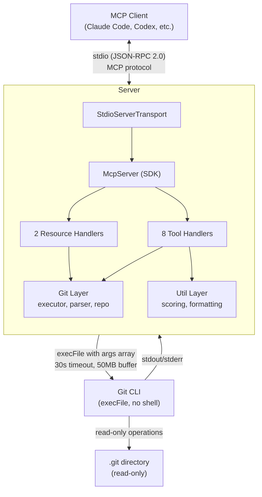
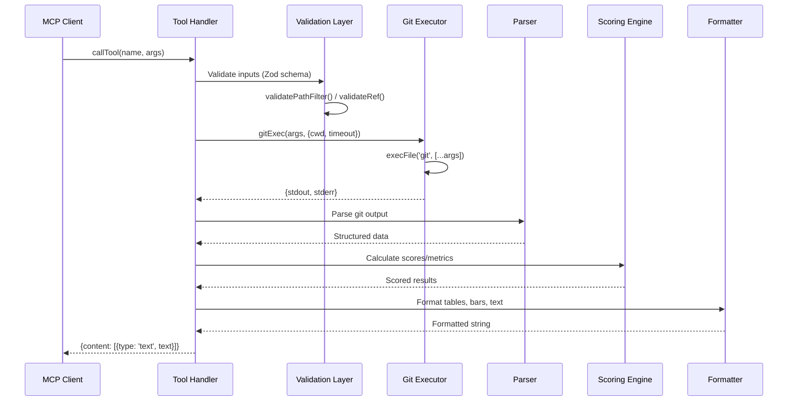
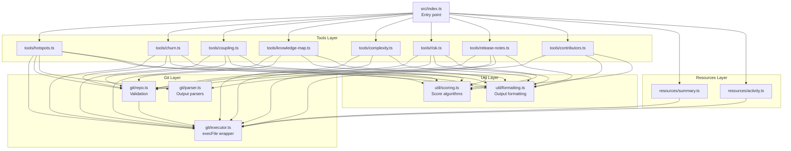
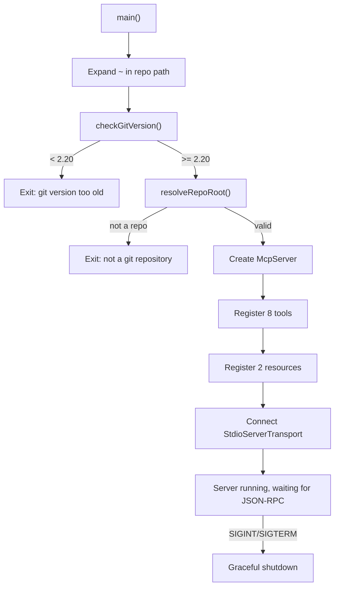

# Architecture

Technical architecture documentation for `mcp-git-intel`.

---

## System Overview

`mcp-git-intel` is a Model Context Protocol (MCP) server that provides git repository analytics to AI coding assistants. It communicates over stdio using JSON-RPC, executes read-only git commands against a local repository, and returns formatted analysis results.

---

## Data Flow

Every tool invocation follows the same pattern:

---

## Module Dependency Graph

---

## Layer Breakdown

### Git Layer (`src/git/`)

The foundation. All interaction with Git passes through this layer.

#### `executor.ts` -- Safe Command Runner

The single point of contact with the operating system for git operations.

- **`gitExec(args, options)`**: Runs `git` with `execFile` (not `exec`). Arguments are passed as an array, never string-interpolated. Returns `{stdout, stderr}`.
- **`gitLines(args, options)`**: Convenience wrapper that splits stdout into trimmed, non-empty lines.
- **`GitTimeoutError`**: Thrown when a command exceeds the timeout (default 30s).

Key safety measures:
- `execFile` prevents shell injection by design -- arguments cannot be interpreted as shell metacharacters.
- `GIT_TERMINAL_PROMPT=0` prevents git from blocking on interactive prompts.
- `GIT_PAGER=''` prevents git from spawning a pager.
- `LC_ALL=C` ensures consistent output format regardless of user locale.
- `windowsHide: true` prevents console windows from flashing on Windows.
- 50MB max buffer prevents memory exhaustion from unexpectedly large output.

#### `parser.ts` -- Output Parsers

Parses raw git output into structured TypeScript objects.

- **`parseLog()`**: Parses custom-formatted `git log` output with numstat into `LogEntry[]` objects. Uses unique separator strings (`---GIT-INTEL-SEP---`) to avoid ambiguity with commit content.
- **`parseShortstat()`**: Parses `--shortstat` output into `{filesChanged, insertions, deletions}`.
- **`parseConventionalCommit()`**: Parses conventional commit subjects (`type(scope): description`) including breaking change markers.
- **`getLogFormat()` / `buildLogArgs()`**: Builders for git log command arguments.

#### `repo.ts` -- Repository Validation

Input validation and repository resolution.

- **`resolveRepoRoot(path)`**: Validates a directory exists and is a git repository. Uses `git rev-parse --show-toplevel` to find the actual root (handles subdirectories and worktrees).
- **`checkGitVersion(cwd)`**: Verifies git >= 2.20 is installed.
- **`validatePathFilter(path, repoRoot)`**: Sanitizes path arguments. Blocks `..` traversal and absolute paths.
- **`validateRef(ref)`**: Validates git refs against a character whitelist. Allows typical ref patterns (branches, tags, ranges) while blocking injection attempts.

### Tools Layer (`src/tools/`)

Each file exports a single `register*` function that registers one tool with the MCP server. All tools follow the same pattern:

1. Define Zod input schema with defaults and descriptions
2. Validate and sanitize inputs
3. Execute git commands via the git layer
4. Parse output into structured data
5. Calculate derived metrics (scoring layer)
6. Format results with tables, bars, and interpretation text
7. Return via `textResult()` or `errorResult()`

All tools are annotated with `readOnlyHint: true` and `openWorldHint: false`.

#### Tool-specific git strategies:

| Tool | Git commands used | Analysis approach |
|------|------------------|-------------------|
| `hotspots` | `log --name-only` | Count file appearances across commits |
| `churn` | `log --numstat` | Sum additions/deletions per file |
| `coupling` | `log --name-only` | Build co-change matrix from multi-file commits |
| `knowledge_map` | `log --numstat` | Per-author stats weighted by recency |
| `complexity_trend` | `log` + `show <hash>:<path>` | Sample file content at intervals, measure indentation/functions |
| `risk_assessment` | `diff --numstat` + `log --name-only` | Combine hotspot history, size, sensitivity, spread |
| `release_notes` | `log` with range | Parse conventional commits, group by type/scope/author |
| `contributor_stats` | `log --numstat` | Per-author profiles with collaboration graph |

### Util Layer (`src/util/`)

#### `scoring.ts` -- Scoring Algorithms

Pure functions for calculating normalized scores.

- **`normalize(value, min, max)`**: Maps a value to 0-100 range.
- **`recencyScore(timestamp, now, halfLife)`**: Exponential decay function. Half-life of 30 days by default. Used to weight recent activity higher.
- **`couplingScore(shared, commitsA, commitsB)`**: `shared / min(commitsA, commitsB)`. Uses `min` (not `max`) so that if B always changes with A, coupling is 1.0 even if A changes independently.
- **`knowledgeScore(params)`**: Weighted formula: 30% volume + 30% frequency + 40% recency.
- **`riskScore(factors)`**: Weighted average of multiple risk factors.
- **`churnRatio(additions, deletions)`**: `deletions / additions`. Higher values mean more rewriting.
- **`daysAgoString(timestamp, now)`**: Human-readable relative time string.

#### `formatting.ts` -- Output Formatting

All output goes through this layer to produce consistent, readable results.

- **`textResult(text)`**: Wraps text in MCP `CallToolResult` format.
- **`errorResult(message)`**: Wraps error in MCP format with `isError: true`.
- **`formatTable(headers, rows, options)`**: ASCII table with configurable column alignment. Right-aligns numeric columns.
- **`formatBar(score, width)`**: Visual score bar: `[████████░░] 80`.
- **`truncate()`, `shortDate()`, `section()`**: Minor formatting helpers.

### Resources Layer (`src/resources/`)

MCP resources provide static-ish data that clients can read at any time (not invoked as tools).

- **`summary.ts`** (`git://repo/summary`): Aggregates branch, last commit, total commits, active contributors, all-time contributors, repo age, top file extensions, total files, and remote URL.
- **`activity.ts`** (`git://repo/activity`): Last 50 commits formatted as a timeline with hash, relative date, author, subject, and change stats.

---

## Security Architecture

### Threat Model

The server runs locally and accepts input from an AI client. The primary threats are:

1. **Shell injection via crafted arguments**: Mitigated by `execFile` (no shell involvement).
2. **Path traversal to read files outside the repo**: Mitigated by `validatePathFilter` blocking `..` and absolute paths.
3. **Git ref injection**: Mitigated by `validateRef` with strict character whitelist.
4. **Denial of service via large repos**: Mitigated by timeouts (30s) and buffer limits (50MB).
5. **Git interactive prompts blocking the server**: Mitigated by `GIT_TERMINAL_PROMPT=0`.

### Why `execFile` and not `exec`

`child_process.exec()` runs commands through a shell (`/bin/sh` or `cmd.exe`), which means special characters in arguments can be interpreted as shell operators. For example, a path containing shell metacharacters could cause unintended command execution.

`child_process.execFile()` bypasses the shell entirely. Arguments are passed directly to the process as an argv array. There is no shell interpretation, so injection is not possible regardless of argument content.

### Read-Only Guarantee

No tool runs any git command that modifies the repository. The commands used are: `log`, `diff`, `rev-parse`, `rev-list`, `ls-files`, `show`, `remote get-url`, and `--version`. None of these write to the working tree, index, or .git directory.

---

## Performance Considerations

### Git Command Efficiency

- Tools use targeted git log formats (custom `--format` strings) to minimize output parsing.
- `--no-merges` is used by default to skip merge commits that inflate change counts without representing real work.
- `--since` filters are pushed to git (server-side filtering) rather than fetching all history and filtering in JS.
- Coupling analysis caps at 50 files per commit to avoid O(n^2) pair generation on large commits.
- Complexity trend samples evenly across history (configurable, default 10 points) rather than analyzing every commit.

### Output Limits

- All tools accept a `limit` parameter (default 20, max 50-100 depending on tool).
- Results are sorted by relevance before truncation so the most important data is always shown.

### Concurrency

- The MCP protocol handles one request at a time over stdio (serial).
- Tools do not spawn parallel git processes. Each tool makes 1-3 sequential git calls.
- The smoke test and CLI run tools sequentially.

---

## Design Decisions

### Formatted text output (not JSON)

Tools return pre-formatted text with markdown tables, score bars, and interpretation sections. This was a deliberate choice:

- AI clients can present the output directly to users without additional formatting logic.
- The interpretation text (e.g., "High coupling means these files are logically connected") helps the AI provide better analysis.
- JSON output would require the AI to format it, adding latency and potential formatting errors.

### Per-tool git commands (not a shared cache)

Each tool makes its own git calls rather than sharing a centralized data cache. Reasons:

- Tools need different git output formats (`--name-only` vs `--numstat` vs custom `--format`).
- Caching would add complexity and memory pressure for repos with long histories.
- Git itself has an efficient pack file format; re-reading is fast.

### Zod for input validation

The MCP SDK uses Zod for schema definition, which provides both runtime validation and TypeScript type inference. Every tool parameter has a default value and description, so tools work with zero arguments.

### Coupling uses `min()` not `max()` denominator

`coupling = shared / min(commitsA, commitsB)` means: if file B changed 5 times and always changed with file A, the coupling is 1.0 -- even if A changed 100 times independently. This captures the "B depends on A" relationship that `max()` would dilute.

### Knowledge score weights recency at 40%

The knowledge score formula (30% volume, 30% frequency, 40% recency) deliberately over-weights recency because code understanding decays. An author who wrote 10,000 lines two years ago knows less about the current state than someone who made 50 commits last month.

---

## Entry Point Flow

---

## Testing Infrastructure

- **Unit tests** (`npm test`): Vitest-based tests for scoring, parsing, and formatting functions.
- **Smoke test** (`npm run smoke`): Connects a real MCP client to the server, calls every tool and reads every resource against a live repo, and prints all results. Catches integration issues that unit tests miss.
- **CLI REPL** (`npm run cli`): Interactive testing tool for ad-hoc tool invocation and resource reading during development.
