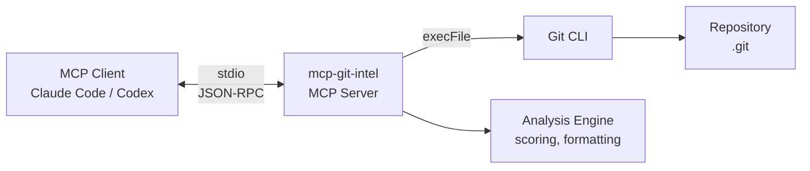
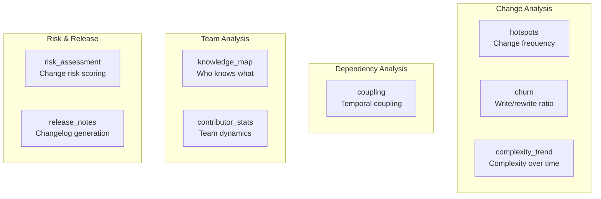

# mcp-git-intel

Git Intelligence MCP Server -- deep repository analytics computed locally from your commit history.

Surfaces the same insights that tools like CodeScene and GitPrime charge for: hotspots, temporal coupling, knowledge maps, churn analysis, complexity trends, risk scoring, and more. Everything runs locally. No external APIs, no data leaves your machine.

This is a **locally-built MCP server**. It is not published to npm. You clone, build, and register it with your MCP client (Claude Code, Codex, etc.).

```
You:    "Analyze this repo -- show me hotspots, risk, and who knows the auth module best."
Claude: [calls hotspots, risk_assessment, knowledge_map in parallel, returns formatted analysis]
```

---

## Architecture



All communication happens over **stdio** using the Model Context Protocol. The server calls Git via `execFile` (never `exec`) to prevent shell injection. All operations are **strictly read-only**.

---

## Tools

8 analysis tools, each returning formatted tables, score bars, and actionable recommendations -- not raw git output.



| Tool | What it does | Key insight |
|------|-------------|-------------|
| `hotspots` | Files that change most frequently | Top 4% of files by change frequency contain 50%+ of bugs |
| `churn` | Code written then rewritten (additions vs deletions) | Churn ratio near 1.0 = code rewritten as fast as it's written |
| `coupling` | Files that always change together | Hidden dependencies not visible in imports |
| `knowledge_map` | Who knows a file/directory best, weighted by recency | Find the right reviewer, spot knowledge silos |
| `complexity_trend` | How a file's complexity evolves over time | Catch files growing out of control |
| `risk_assessment` | Risk score (0-100) for uncommitted or committed changes | Combines hotspot history, size, sensitivity, spread |
| `release_notes` | Structured changelog from conventional commits | Groups by type, extracts breaking changes and PR refs |
| `contributor_stats` | Team dynamics, collaboration graph, knowledge silos | Workload distribution, onboarding planning |

## Resources

| Resource URI | Description |
|-------------|-------------|
| `git://repo/summary` | Repository snapshot: branch, last commit, total commits, active contributors, top languages, age, remote |
| `git://repo/activity` | Recent 50-commit activity feed with stats |

---

## Installation

This server is **not published to npm**. You must clone, build, and register it locally.

### Prerequisites

- **Node.js** >= 18
- **Git** >= 2.20

### Build from source

```bash
git clone <this-repo-url>
cd mcp-server
npm install
npm run build
```

### Register with Claude Code

**Quick registration (analyzes cwd by default):**

```bash
claude mcp add git-intel -- node /absolute/path/to/mcp-server/dist/index.js
```

**With a specific repository:**

```bash
claude mcp add git-intel -- node /absolute/path/to/mcp-server/dist/index.js /path/to/your/repo
```

### Register with any MCP client (manual JSON)

Add to your MCP client's configuration file (e.g. `~/.claude/settings.json` for Claude Code):

```json
{
  "mcpServers": {
    "git-intel": {
      "command": "node",
      "args": ["/absolute/path/to/mcp-server/dist/index.js"],
      "env": {
        "GIT_INTEL_REPO": "/path/to/your/repo"
      }
    }
  }
}
```

> **Tip**: The `~` home directory expansion works in the repo path argument (e.g. `~/projects/my-repo`).

---

## Configuration

The server determines which git repository to analyze using this priority order:

| Priority | Method | Example |
|----------|--------|---------|
| 1 | CLI argument | `node dist/index.js /path/to/repo` |
| 2 | Environment variable | `GIT_INTEL_REPO=/path/to/repo` |
| 3 | Current working directory | Falls back to `process.cwd()` |

The `~` prefix is expanded to the user's home directory in all path inputs.

---

## Usage Examples

Once registered, the tools are available through natural language. You do not call them directly -- the AI client decides which tools to invoke based on your prompt.

**Find bug-prone files:**
> "Show me the change hotspots in the last 60 days"

**Analyze code stability:**
> "What's the churn analysis for the src/api directory over the last quarter?"

**Find hidden dependencies:**
> "Which files are temporally coupled with src/auth/login.ts?"

**Find the right reviewer:**
> "Who knows the src/api directory best?"

**Track complexity growth:**
> "Show me the complexity trend for src/services/payment.ts"

**Assess change risk before merging:**
> "What's the risk assessment for the uncommitted changes?"
> "Assess the risk of changes between main and feature-branch"

**Generate release notes:**
> "Generate release notes from v1.0.0 to HEAD"

**Understand team dynamics:**
> "Show me contributor statistics for the last 6 months"
> "Who are the top collaborators and where are the knowledge silos?"

**Full repo analysis:**
> "Using git-intel, give me a comprehensive analysis of this repository"

See [`docs/EXAMPLES.md`](docs/EXAMPLES.md) for a complete real-world transcript of a full repo analysis session.

---

## Development

```bash
npm run dev          # Run server with tsx (auto-reload, uses cwd as repo)
npm run cli          # Interactive REPL for testing tools and resources
npm run smoke        # Automated smoke test -- runs every tool and resource
npm test             # Run unit tests (vitest)
npm run test:watch   # Watch mode
npm run lint         # Type check (tsc --noEmit)
npm run build        # Compile TypeScript to dist/
```

### CLI REPL

The interactive CLI (`npm run cli`) connects to the server as a real MCP client and provides a REPL:

```
git-intel> tools                          # List all tools
git-intel> resources                      # List all resources
git-intel> call hotspots {"days": 60}     # Call a tool with args
git-intel> call risk_assessment           # Call with defaults
git-intel> read git://repo/summary        # Read a resource
git-intel> exit
```

### Smoke Test

`npm run smoke` connects to the server and calls every tool and every resource against the current repo, printing all results. Useful for verifying nothing is broken after changes.

---

## Security Model

| Concern | Mitigation |
|---------|------------|
| Shell injection | All git commands use `execFile` (array args, no shell interpolation) |
| Path traversal | `validatePathFilter()` blocks `..` and absolute paths |
| Ref injection | `validateRef()` validates git refs against a strict character whitelist |
| Write operations | Strictly read-only. No tool modifies the repository in any way |
| Network access | No external network calls. All data is local |
| Git safety | `GIT_TERMINAL_PROMPT=0` prevents interactive prompts; `GIT_PAGER=''` disables pagers |
| Timeouts | 30-second default timeout on all git commands |
| Buffer limits | 50MB max buffer to prevent memory exhaustion |

---

## Project Structure

```
src/
  index.ts              Entry point, server setup, tool/resource registration
  cli.ts                Interactive REPL for testing
  smoke-test.ts         Automated smoke test
  git/
    executor.ts         Safe git command runner (execFile, timeouts, env)
    parser.ts           Git output parsers (log, numstat, conventional commits)
    repo.ts             Repo validation, path/ref sanitization
  tools/
    hotspots.ts         Change frequency analysis
    churn.ts            Code churn (additions vs deletions)
    coupling.ts         Temporal coupling detection
    knowledge-map.ts    Knowledge scoring per author
    complexity.ts       Complexity trend over time
    risk.ts             Multi-factor risk assessment
    release-notes.ts    Changelog from conventional commits
    contributors.ts     Contributor analytics and collaboration
  resources/
    summary.ts          Repository snapshot resource
    activity.ts         Recent commit activity feed
  util/
    scoring.ts          Normalization, recency decay, coupling, risk scoring
    formatting.ts       Tables, score bars, text output helpers
```

---

## Further Documentation

- **[`ARCHITECTURE.md`](ARCHITECTURE.md)** -- Deep technical architecture, design decisions, module dependencies
- **[`docs/TOOLS.md`](docs/TOOLS.md)** -- Detailed reference for every tool (schemas, examples, interpretation)
- **[`docs/EXAMPLES.md`](docs/EXAMPLES.md)** -- Real-world usage transcript showing a full repo analysis session

## License

MIT. See [LICENSE](LICENSE) for details.
