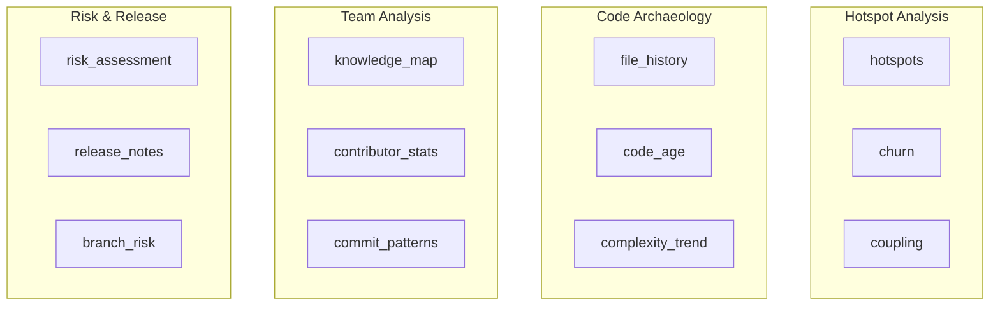
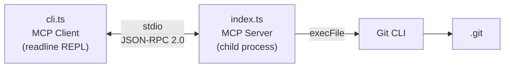

# CLI Reference

The `mcp-git-intel` CLI is an interactive REPL for testing tools and resources. It spawns the MCP server as a child process, connects as a real MCP client over stdio (the same transport AI clients use), and lets you call any tool or read any resource manually.

---

## Quick Start

```bash
npm run cli                       # Analyze repo in current directory
npm run cli ~/projects/my-app     # Analyze a specific repo
npm run cli C:/Users/you/project  # Windows absolute path
```

The CLI accepts one optional argument: the path to the git repository. If omitted, it uses the current working directory. The `~` prefix is expanded to your home directory.

---

## Commands

| Command | Description | Example |
|---------|-------------|---------|
| `tools` | List all 12 tools with parameter names | `tools` |
| `resources` | List all 2 resources with URIs | `resources` |
| `call <tool> [json]` | Call a tool with optional JSON arguments | `call hotspots {"days": 60}` |
| `read <uri>` | Read a resource by URI | `read git://repo/summary` |
| `help` | Show built-in help text | `help` |
| `exit` / `quit` / `q` | Disconnect and quit | `exit` |

---

## Tool Calls

### Syntax

```
call <tool-name> [json-arguments]
```

Arguments are optional. When omitted, the tool uses its default values. When provided, they must be valid JSON.

### All Tools and Their Parameters

#### hotspots

Identify files that change most frequently.

```
call hotspots
call hotspots {"days": 60}
call hotspots {"days": 90, "limit": 10}
call hotspots {"days": 30, "path_filter": "src/"}
call hotspots {"repo_path": "C:/Users/you/other-repo", "days": 60}
```

| Parameter | Type | Default | Description |
|-----------|------|---------|-------------|
| `repo_path` | string | — | Override default repo |
| `days` | number | 90 | Time window |
| `limit` | number | 20 | Max results |
| `path_filter` | string | — | Filter to files under this path |

#### churn

Analyze code churn (additions vs deletions).

```
call churn
call churn {"days": 30}
call churn {"days": 180, "limit": 10, "path_filter": "src/api/"}
```

| Parameter | Type | Default | Description |
|-----------|------|---------|-------------|
| `repo_path` | string | — | Override default repo |
| `days` | number | 90 | Time window |
| `limit` | number | 20 | Max results |
| `path_filter` | string | — | Filter to files under this path |

#### coupling

Detect files that always change together (temporal coupling).

```
call coupling
call coupling {"min_coupling": 0.5}
call coupling {"days": 180, "min_coupling": 0.3, "min_commits": 3}
```

| Parameter | Type | Default | Description |
|-----------|------|---------|-------------|
| `repo_path` | string | — | Override default repo |
| `days` | number | 90 | Time window |
| `min_coupling` | number | 0.5 | Minimum coupling score (0-1) |
| `min_commits` | number | 2 | Minimum shared commits |
| `limit` | number | 20 | Max results |

#### knowledge_map

Find who knows a file/directory best, weighted by recency.

```
call knowledge_map
call knowledge_map {"path": "src/auth"}
call knowledge_map {"path": "src/tools", "days": 180}
```

| Parameter | Type | Default | Description |
|-----------|------|---------|-------------|
| `repo_path` | string | — | Override default repo |
| `path` | string | — | File or directory to analyze |
| `days` | number | 365 | Time window |

#### complexity_trend

Track how a file's complexity changes over time.

```
call complexity_trend {"path": "src/index.ts"}
call complexity_trend {"path": "src/tools/risk.ts", "days": 180, "samples": 15}
```

| Parameter | Type | Default | Description |
|-----------|------|---------|-------------|
| `repo_path` | string | — | Override default repo |
| `path` | string | **required** | File to analyze |
| `days` | number | 365 | Time window |
| `samples` | number | 10 | Number of sample points |

#### risk_assessment

Score the risk (0-100) of uncommitted or committed changes.

```
call risk_assessment
call risk_assessment {"from_ref": "main", "to_ref": "feature-branch"}
call risk_assessment {"from_ref": "HEAD~5", "to_ref": "HEAD"}
```

| Parameter | Type | Default | Description |
|-----------|------|---------|-------------|
| `repo_path` | string | — | Override default repo |
| `from_ref` | string | — | Start ref (omit for uncommitted changes) |
| `to_ref` | string | — | End ref |

#### release_notes

Generate structured changelog from conventional commits.

```
call release_notes {"from_ref": "v1.0.0"}
call release_notes {"from_ref": "v1.0.0", "to_ref": "v2.0.0"}
call release_notes {"from_ref": "HEAD~10", "to_ref": "HEAD"}
```

| Parameter | Type | Default | Description |
|-----------|------|---------|-------------|
| `repo_path` | string | — | Override default repo |
| `from_ref` | string | **required** | Start ref (tag, branch, or commit) |
| `to_ref` | string | `HEAD` | End ref |

#### contributor_stats

Team dynamics, collaboration graph, and knowledge silos.

```
call contributor_stats
call contributor_stats {"days": 180}
call contributor_stats {"days": 365, "path_filter": "src/"}
```

| Parameter | Type | Default | Description |
|-----------|------|---------|-------------|
| `repo_path` | string | — | Override default repo |
| `days` | number | 90 | Time window |
| `path_filter` | string | — | Filter to files under this path |

#### file_history

Full commit history of a specific file with rename tracking.

```
call file_history {"path": "src/index.ts"}
call file_history {"path": "README.md", "days": 180}
call file_history {"path": "src/tools/hotspots.ts", "days": 90, "limit": 20}
```

| Parameter | Type | Default | Description |
|-----------|------|---------|-------------|
| `repo_path` | string | — | Override default repo |
| `path` | string | **required** | File path to analyze |
| `days` | number | 365 | Time window |
| `limit` | number | 30 | Max commits to return (max: 100) |

#### code_age

Show the age of code in each file — identifies stale vs actively maintained files.

```
call code_age
call code_age {"sort": "newest"}
call code_age {"path_filter": "src/", "limit": 15, "sort": "oldest"}
```

| Parameter | Type | Default | Description |
|-----------|------|---------|-------------|
| `repo_path` | string | — | Override default repo |
| `path_filter` | string | — | Filter to files under this path |
| `limit` | number | 30 | Max files to return (max: 100) |
| `sort` | string | `oldest` | Sort order: `"oldest"` or `"newest"` |

#### commit_patterns

Analyze when and how the team commits — day-of-week, time-of-day, commit sizes, and velocity.

```
call commit_patterns
call commit_patterns {"days": 180}
call commit_patterns {"days": 90, "author": "Alice"}
```

| Parameter | Type | Default | Description |
|-----------|------|---------|-------------|
| `repo_path` | string | — | Override default repo |
| `days` | number | 90 | Time window |
| `author` | string | — | Filter to a specific author (exact name match) |

#### branch_risk

Analyze all branches for staleness, divergence, and merge risk.

```
call branch_risk
call branch_risk {"base_branch": "main"}
call branch_risk {"base_branch": "develop", "include_remote": true}
```

| Parameter | Type | Default | Description |
|-----------|------|---------|-------------|
| `repo_path` | string | — | Override default repo |
| `base_branch` | string | `HEAD` | Branch to compare against |
| `include_remote` | boolean | `false` | Include remote tracking branches |

---

## Reading Resources

### Syntax

```
read <resource-uri>
```

### Available Resources

#### git://repo/summary

Repository snapshot with branch, last commit, total commits, contributors, top languages, age, and remote URL.

```
read git://repo/summary
```

#### git://repo/activity

Recent 50-commit activity feed with hash, date, author, subject, and change stats.

```
read git://repo/activity
```

---

## Cross-Repo Analysis

Use the `repo_path` parameter to analyze a different repository without restarting the CLI:

```
git-intel> call hotspots {"repo_path": "C:/Users/you/other-project", "days": 60}
git-intel> call knowledge_map {"repo_path": "~/projects/api-server", "path": "src/"}
git-intel> call churn {"repo_path": "/home/you/monorepo", "days": 30, "path_filter": "packages/core/"}
```

The `~` prefix is expanded to your home directory in `repo_path`.

---

## Tool Categories



---

## Architecture

The CLI uses the MCP SDK's `StdioClientTransport` to spawn and connect to the server — the exact same protocol AI clients like Claude Code use:



This means any behavior you see in the CLI is exactly what an AI client will see. It's a 1:1 testing proxy.

---

## Troubleshooting

| Problem | Cause | Fix |
|---------|-------|-----|
| `Failed to connect to server` | Server crashed on startup | Check that the repo path is valid and git is installed |
| `Invalid JSON: ...` | Malformed arguments | Ensure args are valid JSON with double quotes |
| `Unknown command: ...` | Typo in command name | Type `help` to see available commands |
| Tool returns error about no repo | CLI started outside a git repo and no `repo_path` given | Restart with a repo path or pass `repo_path` in the tool call |
| `Error: Command timed out` | Git command took > 30s | The repo may be very large; try a shorter `days` window |
