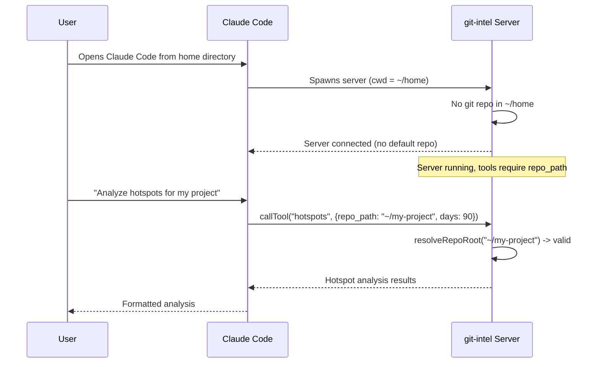

# Real-World Usage Example

This is a real transcript from a session where Claude used the `mcp-git-intel` MCP server to perform a comprehensive analysis of a full-stack application repository (WealthWise). The tools were called in parallel where possible, followed by targeted follow-up analysis.

---

## The Prompt

```
> using git-intel mcp server, analyze this repo
```

---

## Tool Invocations

Claude decided to run several analyses in parallel to build a comprehensive picture.

### Parallel batch 1: Broad analysis

Four tools were called simultaneously:

#### hotspots (days: 180, limit: 20)

```
No file changes found in the specified time range.
```

*Note: This can happen when the `--name-only` log format returns no results for the time range, while `--numstat` (used by churn) does. This is a known edge case with some git history shapes.*

#### churn (days: 180, limit: 20)

```
## Code Churn Analysis (last 180 days)

Total: +23887 / -3368 across 415 files. Showing top 20.

File                                                               Added  Deleted     Net  Churn  Commits
----------------------------------------------------------------  ------  -------  ------  -----  -------
package-lock.json                                                 +10392      -44  +10348   0.00        2
apps/web/src/app/(dashboard)/settings/page.tsx                      +923     -905     +18   0.98        2
DEVOPS.md                                                          +1622       -5   +1617   0.00        2
apps/web/src/app/(dashboard)/recurring/page.tsx                     +738     -720     +18   0.98        2
apps/web/src/app/page.tsx                                          +1150      -23   +1127   0.02        2
apps/web/src/app/(dashboard)/accounts/page.tsx                      +476     -458     +18   0.96        2
apps/web/src/app/(dashboard)/settings/settings-page-client.tsx      +908       -0    +908   0.00        1
packages/shared-types/src/__tests__/schemas.test.ts                 +905       -0    +905   0.00        1
ARCHITECTURE.md                                                     +856       -0    +856   0.00        4
PLAN.md                                                             +829       -0    +829   0.00        1
README.md                                                           +745       -9    +736   0.01        8
apps/web/src/app/(dashboard)/recurring/recurring-page-client.tsx    +723       -0    +723   0.00        1
apps/api/src/seeds/demo.seed.ts                                     +704       -0    +704   0.00        1
.github/workflows/ci.yml                                            +647      -25    +622   0.04        5
apps/web/src/app/(auth)/register/page.tsx                           +340     -322     +18   0.95        2
apps/web/src/app/(dashboard)/transactions/page.tsx                  +318     -300     +18   0.94        2
apps/web/src/app/(dashboard)/goals/page.tsx                         +307     -289     +18   0.94        2
apps/api/README.md                                                  +540       -2    +538   0.00        2
apps/web/src/app/(dashboard)/budgets/page.tsx                       +278     -260     +18   0.94        2
apps/api/src/services/analytics.service.ts                          +486       -6    +480   0.01        2


**Churn ratio** = deletions / additions. Values near 1.0 mean code is being rewritten as
fast as it's written.
High-churn files may indicate: unstable requirements, wrong abstraction, or code that's hard
 to get right.
```

#### coupling (days: 180, min_coupling: 0.4, limit: 25)

```
## Temporal Coupling (last 180 days)

Found 1 coupled pair (showing top 1, min coupling: 0.4).

File A           File B     Coupling  Shared  A total  B total
---------------  ---------  --------  ------  -------  -------
ARCHITECTURE.md  README.md      0.75       3        4        8


### Top Coupled Pairs -- Sample Commits

**ARCHITECTURE.md <-> README.md** (coupling: 0.75)
  Sample commits: "feat: enhance documentation with CI/CD platform details and GitHub Actions
integration", "feat: update documentation with deployment links and demo credentials for
frontend and backend", "feat(ui-api): backend structure finished and frontend demo polished"


**Interpretation**: High coupling means these files are logically connected. Consider:
- Should they be merged into one module?
- Is there a missing abstraction that would decouple them?
- At minimum, changes to one should trigger review of the other.
```

#### contributor_stats (days: 180)

```
## Contributor Statistics (last 180 days)

**3 contributors**, 26 total commits

Author      Commits  Activity          +Lines  -Lines  Files  Last Active
----------  -------  ----------------  ------  ------  -----  -----------
Son Nguyen       19  [██████████] 100   +4780   -3742     68  today
Nguyen            4  [██░░░░░░░░] 21   +54293     -91    403  1 day ago
dav nguyxn        3  [██░░░░░░░░] 16      +57     -14      3  today


### Top Collaborations (shared files)

- Nguyen <-> Son Nguyen: 45 shared files
- Nguyen <-> dav nguyxn: 3 shared files
- Son Nguyen <-> dav nguyxn: 2 shared files


### Knowledge Silos

These authors are the sole contributor to many files:

- **Nguyen**: 357 files with no other contributors
- **Son Nguyen**: 23 files with no other contributors
```

#### risk_assessment (uncommitted changes)

```
## Risk Assessment: uncommitted changes

**Overall Risk**: LOW (22/100)
**Files Changed**: 6
**Total Lines**: +1197 / -32

File                         Risk             Hotspot  Size  Sensitive  Spread
---------------------------  ---------------  -------  ----  ---------  ------
package-lock.json            [████░░░░░░] 37       25   100          0      30
docker-compose.prod.yml      [███░░░░░░░] 31       13     8         70      30
docker-compose.yml           [███░░░░░░░] 31       13     7         70      30
package.json                 [█░░░░░░░░░] 12       25     1          0      30
nginx/nginx.conf             [█░░░░░░░░░] 10       13     7          0      30
.claude/settings.local.json  [█░░░░░░░░░] 9        13     2          0      30


### Recommendations

- **Large change** (1229 lines) -- review fatigue increases defect escape rate.


**Factor weights**: Hotspot 30%, Size 25%, Sensitivity 30%, Spread 15%.
```

---

### Follow-up: Complexity trends on high-churn files

After seeing the churn results, Claude drilled into the two highest-churn files to understand whether the rewriting was healthy or problematic.

#### complexity_trend (path: "apps/web/src/app/(dashboard)/settings/page.tsx", days: 180)

```
## Complexity Trend: apps/web/src/app/(dashboard)/settings/page.tsx (last 180 days)

Sampled 2 points across 2 commits.

**Lines**: 853 -> 16 (down -837)
**Avg Depth**: 4.9 -> 1 (down -3.9)
**Functions**: 12 -> 1 (down -11)

Date        Commit    Lines  Max Depth  Avg Depth  Long Lines  Functions
----------  --------  -----  ---------  ---------  ----------  ---------
2026-03-03  983b7192    853         13        4.9           4         12
2026-03-03  e857acb2     16          3          1           2          1
```

#### complexity_trend (path: "apps/web/src/app/(dashboard)/recurring/page.tsx", days: 180)

```
## Complexity Trend: apps/web/src/app/(dashboard)/recurring/page.tsx (last 180 days)

Sampled 2 points across 2 commits.

**Lines**: 694 -> 16 (down -678)
**Avg Depth**: 7.3 -> 1 (down -6.3)
**Functions**: 6 -> 1 (down -5)

Date        Commit    Lines  Max Depth  Avg Depth  Long Lines  Functions
----------  --------  -----  ---------  ---------  ----------  ---------
2026-03-03  983b7192    694         21        7.3           1          6
2026-03-03  e857acb2     16          3          1           2          1
```

---

### Follow-up: Knowledge maps for critical areas

#### knowledge_map (path: "apps/api/src")

```
## Knowledge Map: apps/api/src (last 365 days)

**Primary expert**: Nguyen (score: 99/100)
**Bus factor**: 2 (authors with score >= 30)

Author      Score            Commits  +Lines  -Lines  Last Active
----------  ---------------  -------  ------  ------  -----------
Nguyen      [██████████] 99       59   +8495      -8  1 day ago
Son Nguyen  [████░░░░░░] 44        8    +131      -6  today


**Score formula**: 30% volume (lines changed) + 30% frequency (commits) + 40% recency
(exponential decay, 30-day half-life).
```

#### knowledge_map (path: "apps/web/src")

```
## Knowledge Map: apps/web/src (last 365 days)

**Primary expert**: Nguyen (score: 99/100)
**Bus factor**: 3 (authors with score >= 30)

Author      Score            Commits  +Lines  -Lines  Last Active
----------  ---------------  -------  ------  ------  -----------
Nguyen      [██████████] 99      108  +13841     -78  1 day ago
Son Nguyen  [███████░░░] 66       35   +4271   -3607  today
dav nguyxn  [████░░░░░░] 40        1     +26      -9  today


**Score formula**: 30% volume (lines changed) + 30% frequency (commits) + 40% recency
(exponential decay, 30-day half-life).
```

---

## Claude's Synthesized Analysis

After gathering all the raw data, Claude synthesized everything into a structured intelligence report:

### Git Intelligence Report -- WealthWise

**Repo Vitals (last 180 days)**

- 26 commits across 415 files, +23,887 / -3,368 lines
- 3 contributors, low bus factor on critical paths

---

### Hottest Churn Files

These files have churn ratios near 1.0 -- code rewritten almost as fast as it's written:

| File | Churn | Pattern |
|------|-------|---------|
| settings/page.tsx | 0.98 | 853 -> 16 lines (extracted to client component) |
| recurring/page.tsx | 0.98 | 694 -> 16 lines (extracted to client component) |
| accounts/page.tsx | 0.96 | Same extraction pattern |
| register/page.tsx | 0.95 | Same extraction pattern |
| transactions/page.tsx | 0.94 | Same extraction pattern |
| goals/page.tsx | 0.94 | Same extraction pattern |
| budgets/page.tsx | 0.94 | Same extraction pattern |

**Interpretation**: This is a **healthy refactor** -- large page components were decomposed into thin server pages + `*-page-client.tsx` client components. The high churn is intentional, not instability. Complexity on `settings/page.tsx` dropped from avg depth 4.9 to 1.0, and `recurring/page.tsx` from 7.3 to 1.0.

---

### Knowledge Silos (Risk)

| Area | Primary Expert | Bus Factor |
|------|---------------|------------|
| apps/api/src | Nguyen (99/100) | 2 |
| apps/web/src | Nguyen (99/100) | 3 |
| 357 files | Nguyen only | 1 |
| 23 files | Son Nguyen only | 1 |

Nguyen is the sole contributor to 357 files. This is a significant knowledge silo -- if Nguyen is unavailable, most of the codebase has no second expert.

---

### Temporal Coupling

Only one notable pair: `ARCHITECTURE.md` <-> `README.md` (0.75 coupling, 3 shared commits). This is expected -- docs update together. No concerning code-level coupling detected.

---

### Uncommitted Changes -- Risk Assessment

**Overall: LOW (22/100)**

| File | Risk | Flag |
|------|------|------|
| package-lock.json | 37 | Large size (+1163 lines) |
| docker-compose.prod.yml | 31 | Sensitive (infra) |
| docker-compose.yml | 31 | Sensitive (infra) |
| package.json | 12 | Low |
| nginx/nginx.conf | 10 | Low |

Nothing alarming. The Docker/Nginx changes warrant a quick review before merging since they touch infrastructure.

---

### Summary

| Signal | Status |
|--------|--------|
| Code stability | Good -- churn is from intentional refactoring, not thrash |
| Complexity trend | Improving -- page components getting simpler |
| Coupling | Clean -- no hidden dependencies |
| Knowledge distribution | Primary risk -- heavy single-contributor concentration |
| Uncommitted risk | Low |

**Top recommendation**: The biggest risk isn't code quality -- it's the knowledge silo. 357 files with a single contributor means reviews and documentation are the main mitigation levers.

---

## Key Observations

This transcript demonstrates several characteristics of the `mcp-git-intel` toolset:

1. **Parallel invocation**: Claude called 5 tools simultaneously in the first batch, reducing total latency.
2. **Follow-up analysis**: After the initial broad sweep, Claude used `complexity_trend` to drill into specific high-churn files to determine if the churn was healthy or problematic.
3. **Cross-tool synthesis**: The final report combined data from all tools to produce insight that no single tool could provide alone (e.g., "high churn + decreasing complexity = healthy refactor").
4. **Actionable output**: The tools provide not just data but interpretation, which Claude used to build its analysis. The final recommendation (knowledge silo mitigation) came from connecting contributor_stats, knowledge_map, and coupling results.
5. **Formatted output**: Tables, score bars, and section headers made the raw tool output immediately readable without additional formatting.

---

## Using `repo_path` for Cross-Repo Analysis

When the server is started outside a git repository (or you want to analyze a different repo), every tool accepts the `repo_path` parameter:

### The Prompt

```
> Analyze the hotspots and contributor stats for my jwt-module project
```

### Tool Invocations

Claude detects that the current directory is not the jwt-module repo and passes `repo_path` explicitly:

#### hotspots (repo_path: "C:/Users/you/jwt-module", days: 90)

```
## Change Hotspots (last 90 days)

Analyzed 28 changed files. Showing top 5.

File                      Changes  Authors  Last Changed  Heat
------------------------  -------  -------  ------------  ---------------
src/token/jwt.ts               12        2    2026-03-08  [██████████] 100
src/middleware/auth.ts          8        1    2026-03-07  [██████░░░░] 67
src/config/keys.ts              6        2    2026-03-05  [█████░░░░░] 50
...
```

#### contributor_stats (repo_path: "C:/Users/you/jwt-module", days: 90)

```
## Contributor Statistics (last 90 days)

**2 contributors**, 35 total commits
...
```

### Error When No Repo Available

If `repo_path` is omitted and the server has no default repo:

```
No git repository available. Either:
1. Open Claude Code inside a git repository directory, OR
2. Pass the repo_path parameter with an absolute path to a git repo.

Example: { "repo_path": "C:/Users/you/your-project" }
```

This error message is designed to be immediately actionable — the AI agent can relay the instructions to the user and retry with the correct path.

### Resilient Startup Flow


